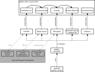

# Architecture

This chapter presents *updated*'s general architecture, the contents and
thought process behind its different crates *updated*, *updated-macros*,
and *libupdated*, as well as a list of currently available implementations of its
traits.

## Overview

*Updated* is a system service that can orchestrate and schedule different
*workflows*, mainly for OTA updates. These generic workflows are defined using
traits that encapsulate common responsibilities and roles during an update
process, e.g. an *UpdateSource* that can be polled for available updates or an
*Installer* that installs the contents of an update to disk.

The following figure presents a (simplified) version of a typical update workflow,
the used traits and their implementations.



The central element of the update process is the `update_workflow`
workflow, typically defined in a project specific crate, e.g. updated-«project».
This workflow is registered with *updated*'s workflow executor by using the
`workflow` macro to annotate the workflow function.

In order to reuse update logic where possible, the workflow uses a generic
template for an update process with user consent: `update_with_consent_flow`.

This template describes the update process using the *UpdateSource*,
*ConsentHandler*, *PersistentStore*, *Installer*, and *ProgressReporter*
traits. The calling `update_workflow` fills these generic traits with
concrete implementations, e.g. *Hawkbit* as the *UpdateSource*.

## updated crates

* **updated:** The workflow executor that runs a selected workflow when
  started. The workflow to run and its configuration are specified through
  *updated's* CLI as explained in the [manual](manual.md#manual).
* **libupdated:** This crate on the one hand contains generic traits and
  workflow templates, and on the other hand provides some implementations that
  implement these traits.
* **libupdated-macros:** Helper crate that contains the `#workflow` macro to
  register new update workflows.

## Workflows

A workflow is simply a function annotated with the `#workflow` macro to
register it with *updated*. Details on how to create custom workflows can be
found in [this section](manual.md#defining-custom-update-workflows).

*libupdated* provides two workflow templates as a starting point for custom
workflows: `update_with_consent_flow`, a full update with user consent, and
`consent_flow_no_install`, just the user consent without installing the update.
This can be useful if *swupdate-suricatta* is used to download the update.

The `update_with_consent_flow` workflow template does not report a successful
installation by itself. Instead, an accompaniying `monitor_update` template is
provided that runs integrity checks on the system after the installation --
typically after a reboot into the new system. If these checks are successful,
the update is marked as successful.

In order to preserve information on the newly installed version and that update
checks should be run, the `update_with_consent_flow` persists the version
(action_id) of the installed update in the persistent store: the key
`update_needs_testing` is set to the version (action_id) of the update and
deleted if all checks are successful. Otherwise, the workflow fails with
`UpdateError::RollbackNeeded(...)`.

## libupdated Traits

### UpdateTrigger

An *UpdateTrigger* encapsulates a condition to start an update. This condition
could be externally triggered, e.g. by sending a message to the client that an
update is available, or internally triggered, e.g. through a timer to poll the
configured *UpdateSource* for an update.

Oftentimes, multiple triggers are used and must be distinguished or the update
needs to be configured depending on the triggering event. For this reason, the
trigger accepts a generic type to return user defined data when an update is
triggered.

``` rust
use libupdated::traits::update_trigger::*;
use libupdated::update_workflow::UpdateError;
use std::time::Instant;

enum TriggerSource {Manual(String), Timed(Instant)}

async fn example(trigger: &mut impl UpdateTrigger<TriggerSource>)
     -> Result<(), UpdateError> {
    match trigger.update_triggered().await? {
        TriggerSource::Manual(config) => {
            println!("Manual update triggered. Config: {config}")
        },
        TriggerSource::Timed(time) => {
            println!("Timed update triggered. Time: {time:?}")
        },
    }

    Ok(())
}
```

*Libupdated* provides triggers that start updates:

* at a constant *Rate*
* *Immediately* (mainly for tests)
* as a reaction to a *CheckForUpdates* MQTT message (*MqttUpdateTrigger*)

### UpdateSource

An *UpdateSource* provides the *Update*. It can be polled in order to check
whether a new *UpdateInfo* is available. This *UpdateInfo* can be queried for
metadata and whether a user consent is necessary. It then exposes the *Update*
that can be downloaded or directly streamed to the *Installer*.

``` rust
use libupdated::traits::update_source::*;
use libupdated::update_workflow::UpdateError;
use std::path::PathBuf;

async fn example(source: &mut impl UpdateSource) -> Result<(), UpdateError> {
    let mut update_info = source.check_for_updates().await?;

    if update_info.needs_consent() {
        // TODO: actually ask the user
        update_info.give_consent().await?;
    }

    // now we can get the update
    let update = update_info.update()?;

    // download the update
    let update_file = update.save_to_disk(Some(PathBuf::from("/tmp"))).await?;

    Ok(())
}
```

Currently, *libupdated* provides *Hawkbit* as an implementation of
*UpdateSource*, which uses [Hawkbit's DDI API](https://eclipse.dev/hawkbit/apis/ddi_api/)
to fetch updates from a Hawkbit server.

### ConsentHandler

The *ConsentHandler* provides a user interface to accept or decline an update.

``` rust
use libupdated::traits::consent_handler::*;
use libupdated::traits::update_source::*;
use libupdated::update_workflow::UpdateError;

async fn example(consent_handler: &mut impl ConsentHandler,
                 update_info: &impl UpdateInfo) -> Result<(), UpdateError> {
    if consent_handler.ask_for_consent(update_info).await? {
        // install update
    } else {
        // don't install update
    }

    Ok(())
}
```

Currently, *libupdated* provides two implementations of a *ConsentHandler*:

* *AutoConsent* always accepts or always declines an update.
* *MqttConsent* connects to a MQTT broker, sends a *ConsentRequestMsg*
  containing the update metadata and reports the received result from a
  *ConsentResponseMsg* back to the caller. Details on the MQTT consent protocol
  can be found [here](consent_protocol.md#mqtt-user-consent--update-protocol-specification).

### PersistentStore

The *PersistentStore* provides the update workflow with the capability to
persistently store information across multiple workflow runs.

``` rust
use libupdated::traits::persistent_store::*;
use libupdated::update_workflow::UpdateError;

async fn example(store: &mut impl PersistentStore) -> Result<(), UpdateError> {
    if !store.exists("initialized").await? {
        // do initialization

        // save initialization state
        store.save("initialized", "true").await?;
    } else {
        let data = store.load("previous_data").await?.unwrap();
    }

    Ok(())
}
```

*libupdated* provides two implementations:

* *FileStore*, which implements *PersistentStore* by
writing json-encoded data to a file.
* *UBootEnv*, which persists key/value pairs in the U-Boot environment.

### Installer & Rollback

The *Installer* takes an update and installs it on a device. It might provide
*InstallationFeedback* on its installation progress through an
*InstallProgress* iterator.

The *Rollback* can be seen as the inverse of an installer. It restores the
system state before the latest update was installed. As this update might have
been installed some time ago, information on the update to roll back is not
given as an argument. Instead, the *Rollback* should use available system
information or cooperate with the *Installer*, so it persists, e.g. lists of
installed files on the system. Please note, that *Rollback* is separate from
the *Installer* trait, as not every installation can be rolled back.

``` rust
use libupdated::traits::installer::*;
use libupdated::traits::update_source::*;
use libupdated::update_workflow::UpdateError;

async fn example(installer: &(impl Installer + Rollback),
                 update: &impl Update) -> Result<(), UpdateError> {
    let mut progress = installer.install(update)?;

    while let Some(feedback) = progress.next().await? {
        println!("Status: {}, Message: {}", feedback.status, feedback.message);
    }

    // installation finished, uninstall it again

    installer.rollback().await?;

    Ok(())
}
```

Currently, two implementations of *Installer* exist in *libupdated*:

* *DirectoryInstaller* simply installs the files to a target directory.
* *SWUpdate* uses the `swupdate-client` application to install a swu-file on
  the target.

*SWUpdate* also implements the *Rollback* trait by forcing a system
rollback in the bootloader.

### ProgressReporter

A *ProgressReporter* reports the current status of an *Update*, e.g. to a
server or a log file.

``` rust
use libupdated::traits::installer::*;
use libupdated::traits::progress_reporter::*;
use libupdated::traits::update_source::*;
use libupdated::update_workflow::UpdateError;

async fn example(reporter: &mut impl ProgressReporter,
                 update: &impl Update) -> Result<(), UpdateError> {
    let progress_msg = ProgressMessage {
        state: UpdateState::Finished,
        cnt_of: (100, 100),
        message: "Update installed successfully".to_string(),
    };

    reporter.report(update, &progress_msg).await?;

    Ok(())
}
```

Multiple implementations of *ProgressReporter* exist:

* *HawkbitProgressReporter* reports the update progress back to the hawkbit
  server.
* *LogReporter* uses the `info!` logger to report update progress to console.

Additionally, *ProgressReporter* is generically implemented for tuples of
*ProgressReporter*s, i.e. `(HawkbitProgressReporter, LogReporter).report(…)`.

### IntegrityCheck

One or more *IntegrityCheck*s are run after a new update is installed to
validate that the updated system runs without problems.

``` rust
use libupdated::update_workflow::UpdateError;
use libupdated::integrity_check::IntegrityCheck;

async fn example(checks: &mut impl IntegrityCheck) {
  match checks.system_is_ok().await {
    Ok(()) => {
      println!("Everything ok!");
    },
    Err(UpdateError::RollbackNeeded(reason)) => {
      println!("Rollback: {reason}");
    },
    Err(_) => {
      println!("Checks crashed!");
    }
  };
}
```

Like *ProgressReporter*, tuples of IntegrityChecks are IntegrityChecks
themselves.

Two simple implementations of IntegrityChecks are provided by libupdated:

* *SystemdIsSystemRunning* runs `systemctl is-system-running --wait` and checks
  its result code.
* *Timeout* waits for a given duration, then reports success. This can be used
  to assert general system stability over a certain time.
